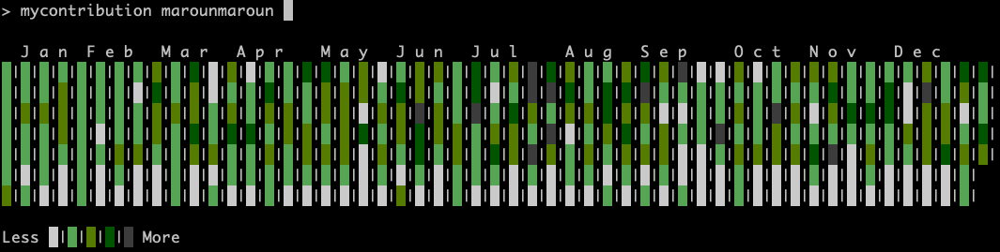

# mycontribution 

Be proud of your GitHub contributions without leaving your shell!


### Running

```bash
mycontribution <username> [symbol]
```

You can provide your own symbol to be shown in the graph:


